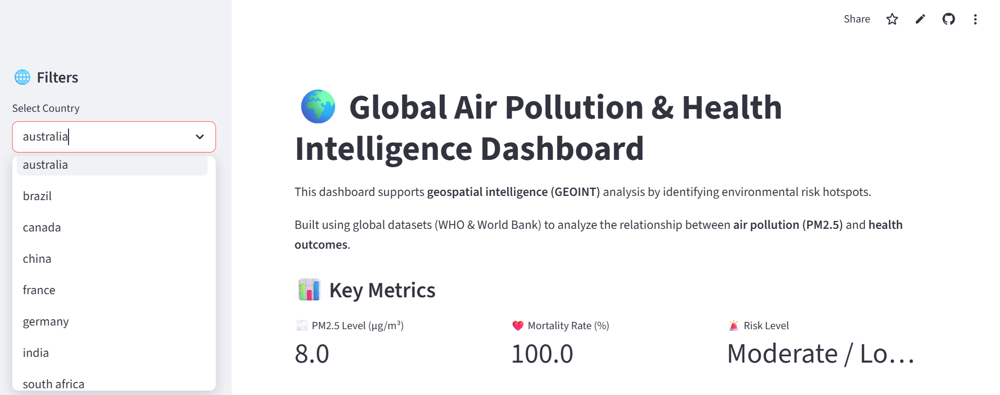
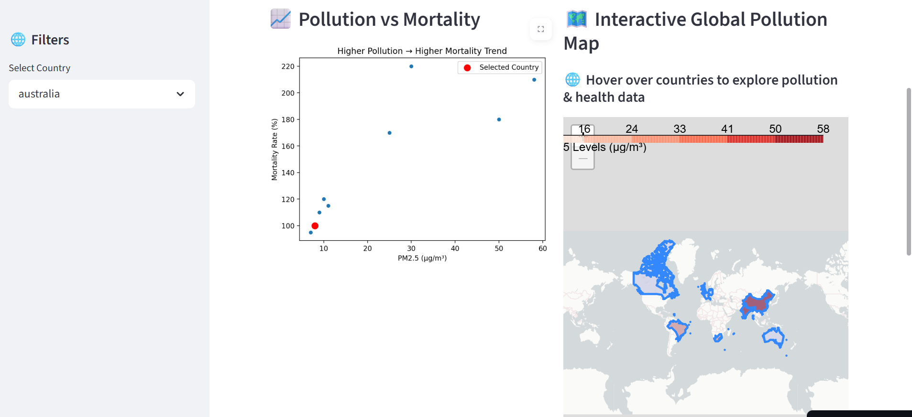
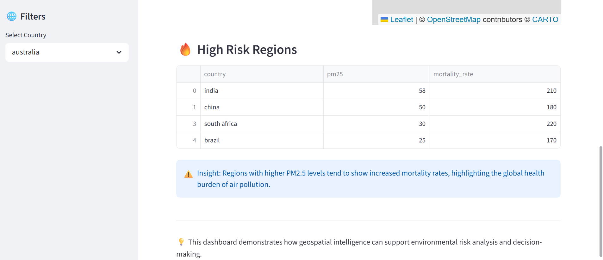

# 🌍 Global Air Pollution & Health Intelligence Dashboard

---

## 📌 Overview

This project analyzes the relationship between **air pollution (PM2.5)** and **health outcomes** across countries using **geospatial intelligence (GEOINT)** techniques.

It integrates **data science, spatial analysis, and interactive visualization** to identify global environmental health risks and high-risk regions.

---

## 🚀 Live Demo

👉 https://global-air-pollution-health-intelligence-dashboard.streamlit.app/

---

## 🗺️ Key Features

- 🌍 Interactive global choropleth map (Folium)
- 📊 PM2.5 vs Mortality correlation analysis
- 🎯 Country-level filtering
- 🚨 Risk classification (High / Moderate / Low)
- 🔥 Hotspot detection using statistical thresholds

---

## 📸 Dashboard Preview

---

## 🧠 Methodology

1. Data cleaning and normalization  
2. Merging pollution and health datasets  
3. Geospatial joins using GeoPandas  
4. Visualization using Streamlit and Folium  
5. Risk classification based on statistical thresholds  

---

global-air-pollution-health-intelligence-dashboard/
│── app.py
│── requirements.txt
│── README.md
│── data/
│ ├── pm25_global.csv
│ ├── health_data.csv
│ ├── world.geojson
│── outputs/

---

## 🛠️ Tech Stack

- Python  
- Streamlit  
- GeoPandas  
- Folium  
- Pandas  
- Matplotlib  
- Seaborn  

---

## 🌐 Data Sources

- WHO Global Air Quality Data (PM2.5)  
- World Bank Health Indicators  
- Natural Earth GeoJSON  

---

---

## 🛠️ Tech Stack

- Python  
- Streamlit  
- GeoPandas  
- Folium  
- Pandas  
- Matplotlib  
- Seaborn  

---

## 🌐 Data Sources

- WHO Global Air Quality Data (PM2.5)  
- World Bank Health Indicators  
- Natural Earth GeoJSON  

---

## 💼 GEOINT Relevance

This project demonstrates:

- 🌍 Geospatial data integration  
- 🗺️ Spatial visualization & mapping  
- 📊 Intelligence-style hotspot detection  
- 📈 Data-driven decision-making  

---

## 📊 Key Insight

⚠️ Countries with higher PM2.5 levels tend to show increased mortality rates, highlighting the global health burden of air pollution.

---

## 👤 Author

**Deeksha Gupta**

---

## ⭐ If you found this project useful, consider giving it a star!

## 📂 Project Structure
